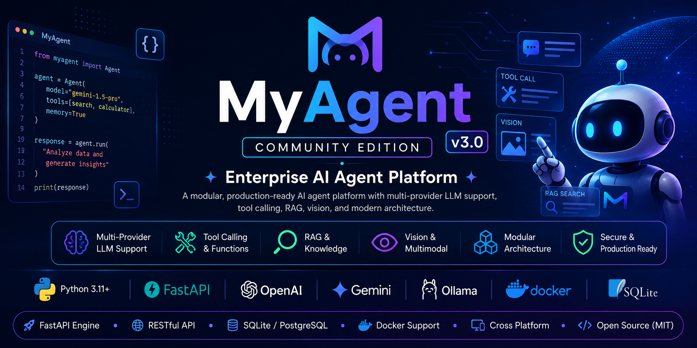

<p align="center">
  
</p>
# 🚀 MyAgent Community Edition v3.0

Enterprise-grade AI Agent Platform with Multi-Provider LLM Support, FastAPI, Tool Calling, RAG, Vision, and Modular Architecture.


---
MyAgent is a simple, modular AI-agent platform with a FastAPI engine, static web
client, Flutter client, and Electron desktop shell. Community Edition starts
with SQLite and the built-in mock provider, so no external infrastructure or
paid API key is required.

> **Release state:** v3.0 source candidate. The independent code, SQLite,
> migration, local runtime, security-static-analysis, and OpenAPI gates pass.
> Docker, PostgreSQL, Flutter, and the online Python dependency-audit gate are defined in
> CI but could not be executed in the audit environment. A clean offline npm install
> and audit passed; Electron packaging was blocked only by external DNS. See `PROJECT_STATUS.md`.

## Design principles

- Small modular monolith; no service mesh or mandatory queue.
- SQLite for community/local use and PostgreSQL for production.
- Optional functionality behind explicit feature flags.
- No Redis, Qdrant, worker, queue, analytics, or monitoring dependency at
  startup.
- Secure defaults, typed configuration, migrations, health checks, and bounded
  memory/context.

## Quick start — local

Requirements: Python 3.11–3.13 and Node.js only if developing the desktop client.

```bash
cp .env.example .env
make setup
make migrate
make run
```

Open `http://127.0.0.1:8000/docs`. The default provider is `mock`, so registration
and chat work offline.

## Quick start — Docker Compose

```bash
cp .env.example .env
docker compose up --build
```

- API: `http://localhost:8000/api/v1`
- OpenAPI UI: `http://localhost:8000/docs`
- Web client: `http://localhost:8080`

The Compose command applies Alembic migrations automatically and persists the
SQLite database in a named volume.

## Production

Use PostgreSQL and the production Compose file or the included Render/Railway
configuration:

```bash
cp .env.production.example .env
# Replace every placeholder and set HTTPS CORS/host values.
docker compose -f docker-compose.production.yml up --build -d
```

Production mode rejects weak/default secrets, SQLite, wildcard CORS, non-HTTPS
origins, demo seeding, debug mode, and automatic table creation.

## Components

| Path | Purpose | Required for Community API |
|---|---|---:|
| `MyAgent-Engine` | FastAPI, auth/RBAC, providers, tools, memory, persistence | Yes |
| `MyAgent-Web` | Static PWA served by Nginx | No |
| `MyAgent-Mobile` | Flutter client | No |
| `MyAgent-Studio` | Electron shell | No |
| `docs` | Architecture, API, deployment, audits | Yes for maintainers |

## Feature flags

`FEATURE_TOOLS=true` and `FEATURE_RAG=false` by default. Enterprise extension
flags such as Redis, Qdrant, workers, queues, marketplace, analytics, metrics,
monitoring, clustering, and enterprise providers are inert and disabled in
Community Edition. Enabling an extension that is not bundled fails with an
explicit configuration error rather than a hidden import or startup failure.

## Providers

The registry supports mock, OpenAI Responses, Gemini, OpenRouter, Anthropic,
DeepSeek-compatible, Kimi-compatible, Z.AI-compatible, and Ollama providers.
Keys are read only from environment configuration. Provider fallback, bounded
retry, streaming, health checks, usage tracking, and cost estimation are built
in.

## Quality commands

```bash
make lint
make typecheck
make coverage
make security       # requires internet for pip-audit
make openapi
make check
make benchmark
make package
```

Current independent result: 104 tests passed with 85.04% repository coverage.
The committed `docs/openapi.json` is generated from the application and checked
in CI.

## Documentation

Start with `ARCHITECTURE.md`, `CONTRIBUTING.md`, `docs/DEPLOYMENT.md`, and
`AI_CONTEXT.md`. The complete engineering outcome and remaining release blockers
are in `FINAL_REPORT.md` and `PROJECT_STATUS.md`.

## License

MIT. See `LICENSE`.
